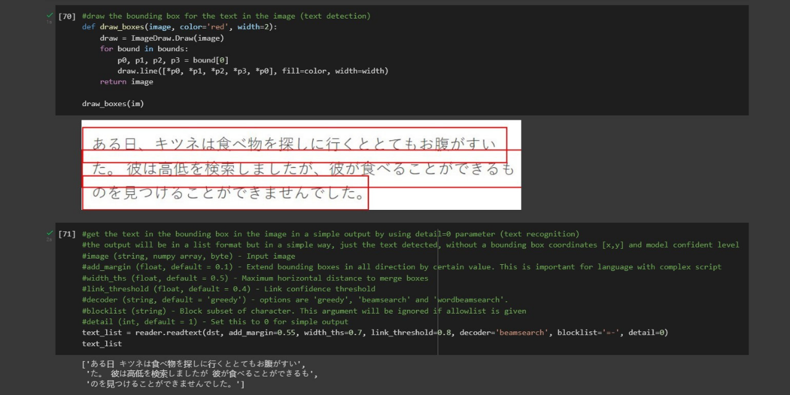

# AI Image-to-Speech Recognition Program using Python Programming Language
This is the final project of the Intelligent System Application Development course and I worked it on with two of my friends. In this project, we created an AI Image-to-Speech Recognition program using Python Programming Language with its several libraries such as OpenCV, EasyOCR, Googletrans, gTTS, PIL, IPython, and Matplotlib.

This project or program was conducted with the aim of helping people who cannot read or even blind people to find out the contents of a text containing information in the form of images by hearing the text audio, with the help of image-to-speech. In addition, our project can also help other people to translate an image containing text into various languages and can also listen to the text audio. To use this program, the user must input an image file that contains text in it, it could be in any image file format, then the program will read and convert the image-to-text form by using OCR (Optical Character Recognition) and after that, the image that has become text form will be converted to audio, so that the user can listen to the text that contained in the inputted image and the user can also translate the text into the various other languages and listen to the text audio.

For the detail on how we make it you may download and read our report that I have already attached within this repository.

